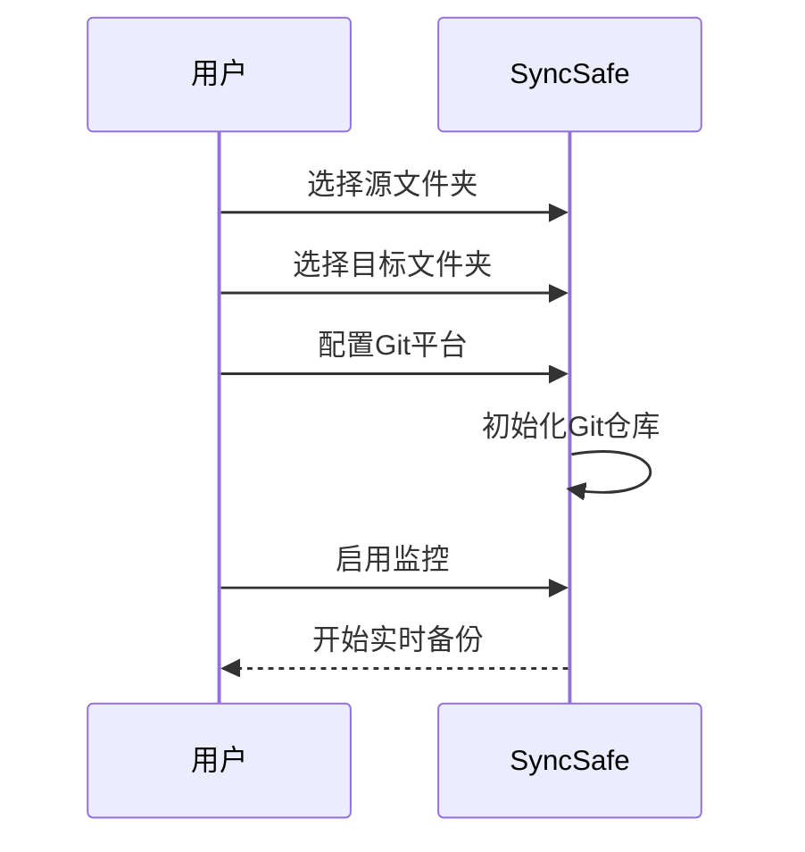

# 🔒 SyncSafe: 文件备份与版本控制工具

<p align="center">
  
  
  
</p>

> 专业级的文件备份解决方案，集成本地备份与Git版本控制，确保您的数据安全无忧

**SyncSafe** 是一款功能强大的桌面应用程序，提供文件自动备份、实时监控和Git版本控制功能，专为需要可靠数据保护的开发者和专业人士设计。

<br/>

## ✨ 核心功能

### 🔄 智能文件备份
- **实时监控**：自动检测文件变化并触发备份
- **增量备份**：仅复制修改过的文件，节省时间和空间
- **防抖机制**：5秒延迟确保稳定备份
- **多平台支持**：完美兼容Windows、Linux和macOS

### 🔗 Git集成
- **双平台支持**：无缝集成Gitee和GitHub
- **自动提交**：变化自动提交到远程仓库
- **安全认证**：访问令牌加密管理
- **冲突解决**：自动处理文件锁定问题

### 📊 历史记录与统计
- **详细备份日志**：记录每次备份的文件变化
- **可视化统计**：成功/失败率、文件变更量
- **CSV导出**：支持历史记录导出分析
- **时间轴视图**：直观展示备份历史

<br/>

## 🚀 快速开始

### 系统要求
- Go 1.18+
- Git (用于版本控制功能)
- 支持平台：Windows, Linux, macOS

### 安装步骤
```bash
# 克隆仓库
git clone https://github.com/Ouniel/syncsafe.git
cd syncsafe

# 安装依赖
go mod tidy

# 编译程序
go build -o syncsafe

# 运行程序 (Windows)
.\syncsafe.exe

# 运行程序 (Linux/macOS)
./syncsafe
```

### 首次配置
1. 选择源文件夹和目标备份文件夹
2. 在"设置"中配置Git平台信息
3. 启用"Git备份"选项
4. 点击"开始监控"激活自动备份

<br/>

## 🖥️ 界面概览

### 主界面

- **文件夹选择**：直观的源/目标路径展示
- **监控控制**：一键启停文件监控
- **立即备份**：手动触发备份操作
- **Git配置**：集成Git平台设置

### 历史记录

- **统计卡片**：总备份次数、成功率、失败率
- **时间线视图**：按时间倒序展示备份记录
- **详情展示**：文件变更、备份耗时、错误信息
- **导出功能**：CSV格式导出历史数据

<br/>

## ⚙️ 技术架构


### 核心组件
1. **文件监控系统**：基于fsnotify实现实时文件变化检测
2. **智能备份引擎**：增量复制算法优化性能
3. **Git集成层**：封装Git命令实现自动化操作
4. **历史管理模块**：JSON存储备份记录
5. **统计引擎**：实时计算备份成功率指标

<br/>

## 📚 使用指南

### 备份配置


### Git配置说明
| 配置项 | 说明 | 示例 |
|--------|------|------|
| **平台** | Gitee或GitHub | `Gitee` |
| **用户名** | Git提交用户名 | `yourname` |
| **邮箱** | Git提交邮箱 | `email@example.com` |
| **仓库地址** | HTTPS格式仓库URL | `https://gitee.com/user/repo.git` |
| **访问令牌** | 平台API访问令牌 | `ghe_xxxxxxxxxx` |

### 高级功能
1. **防抖设置**：默认5秒延迟备份，避免频繁操作
2. **冲突解决**：自动检测并解决Git锁定问题
3. **增量分析**：智能识别新增/修改/删除文件
4. **错误重试**：文件操作失败时自动重试3次

<br/>

## ⚠️ 注意事项

<details>
<summary><b>文件路径限制</b></summary>

- **路径长度**：Windows系统路径不超过260字符
- **特殊字符**：避免使用`|`, `*`, `?`, `"`, `<`, `>`等特殊符号
- **空格处理**：路径中的空格会被自动替换为下划线
- **权限要求**：确保对目标文件夹有写入权限
</details>

<details>
<summary><b>Git集成最佳实践</b></summary>

1. **令牌权限**：
   ```markdown
   - Gitee: 需要`projects`写入权限
   - GitHub: 需要`repo`范围权限
   ```
   
2. **仓库初始化**：
   ```bash
   # 首次使用需在目标文件夹执行
   git init
   git remote add origin <仓库URL>
   ```

3. **大文件处理**：
   ```markdown
   - 大于100MB文件建议使用Git LFS
   - 配置.gitattributes文件管理二进制文件
   ```
</details>

<details>
<summary><b>性能优化建议</b></summary>

1. **排除目录**：
   ```markdown
   - 在源文件夹创建`.syncignore`文件
   - 每行一个排除模式（支持通配符）
   ```

2. **监控范围**：
   ```markdown
   - 避免监控整个系统分区
   - 只选择必要的工作目录
   ```

3. **备份策略**：
   ```markdown
   - 重要数据：实时监控
   - 普通数据：每日定时备份
   - 存档数据：手动备份
   ```
</details>

<br/>

## 📜 许可协议

本项目采用 **MIT 许可证** - 详细信息请查看 [LICENSE](LICENSE) 文件。

### 主要条款
| 允许 | 要求 | 禁止 |
|------|------|------|
| ✅ 商业使用 | ❗ 保留版权声明 | 🚫 责任追究 |
| ✅ 修改分发 | ❗ 包含许可副本 | 🚫 商标使用 |
| ✅ 私人使用 | ❗ 明确变更说明 | 🚫 担保承诺 |

<br/>


---
**让数据安全无忧** - 专业级的文件保护解决方案 🔒
